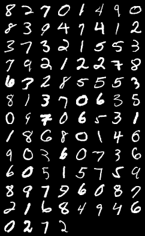
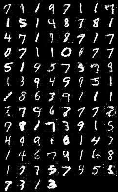

# GAN (Generative Adversarial Networks)

This script implements the paper *[Generative Adversarial Networks](https://arxiv.org/abs/1406.2661)*.

## Intro
Criterion is Binary Cross Entropy which defined as following:
$$
loss(o, t) = - 1/n \sum_i (t[i] * log(o[i]) + (1 - t[i]) * log(1 - o[i]))
$$

For discriminator model, cost functions is:
$$
\mathcal{L}_{D,total}=\mathcal{L}_{D, real} + \mathcal{L}_{D, fake} \\
\mathcal{L}_D=-\frac{1}{2} \mathbb{E}_{x\sim p_{data}} \log D(x) - \frac{1}{2} \mathbb{E}_{z} \log (1-D(G(z)))
$$

For generator model, we use heuristically designed non-saturating cost function instead of the minimax one:
$$
\mathcal{L}_G=\mathcal{L}_{G, fake} = - \frac{1}{2} \mathbb{E}_{z} \log (D(G(z)))
$$

## Usage
Run `python3 main.py` to start training GAN.

## Structure
- `data_loader.py`: dataset setting and data loader.
- `models.py`: discriminator and generator network model.
- `params.py`: parameters for the training process.
- `utils.py`: some useful fuctions for training.

## Result
- Images from MNIST dataset:

  

- Images generated by model (300 iters):

  
