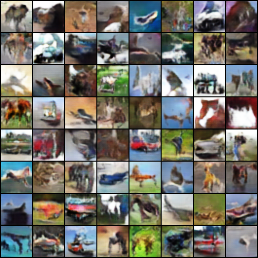

# WGAN-GP (Wasserstein GANs with Gradient Penalty)

This script implements the paper *[Improved Training of Wasserstein GANs](https://arxiv.org/abs/1704.00028)*.

## Usage
Run `python3 main.py` to start training WGAN-GP.

## Structure
- `data_loader.py`: dataset setting and data loader.
- `models.py`: discriminator and generator network model.
- `params.py`: parameters for the training process.
- `utils.py`: some useful fuctions for training.

## Result

Samples from CIFAR dataset:

Samples from generator (50000 iters):

