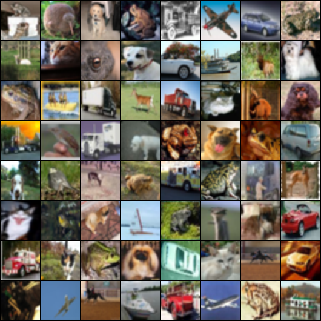
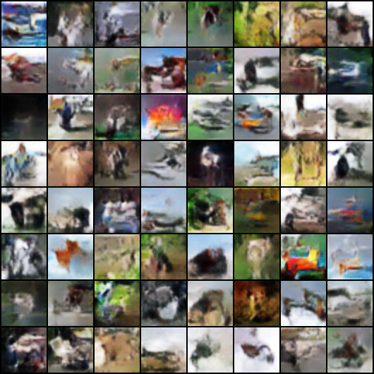

# WGAN (Wasserstein GAN)

This script implements the paper *[Wasserstein GAN](https://arxiv.org/abs/1701.07875)*.

## Usage
Run `python3 main.py` to start training WGAN.

## Structure
- `data_loader.py`: dataset setting and data loader.
- `models.py`: discriminator and generator network model.
- `params.py`: parameters for the training process.
- `utils.py`: some useful fuctions for training.

## Result

- Images from CIFAR-10 dataset:

  

- Images generated by WGAN (100 iters, use BatchNorm):

  
